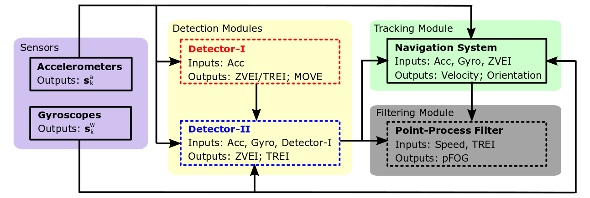

#### Modeling, detecting, and tracking of freezing of gait in Parkinson disease using inertial sensors
##### Background
Parkinson disease (PD) is the second most common neurodegenerative disorder, affecting 1-1.5 million people in the United States alone. Approximately 50% of people with PD experience freezing of gait (FOG), a brief, episodic absence or marked reduction of forward progression of the feet despite the intention to walk. FOG causes falls and is resistant to medication in more than 50% of cases. FOG episodes can often be interrupted by mechanical interventions or strategies (e.g., a verbal reminder to march), but it has not been practical to apply these interventions on demand (e.g., there is not usually another person to detect an FOG episode and provide the reminder). Wearable sensors offer the possibility of detecting FOG episodes in real time and thus develop a "closed-loop" approach to treatment: real time detection could be coupled with on-demand interventions to reduce the duration of FOG episodes.

##### Our research
* We proposed a system design to detect and track FOG using inertial sensors in real time.
* We developed physically-based signal models for the sensor data associated with the FOG patterns such as alternating trembling in the lower extremities (includes the hip, knee, and ankle joints, and the bones of the thigh, leg, and foot), and no movement of the limbs and trunk.
* To filter out the falsely-detected FOG events, we developed a point-process filter which computes the probability of FOG (pFOG). Regions in the sensor data with high values of pFOG indicate FOG events.
* We evaluated the system performance by comparing the overlapping and non-overlapping regions of FOG detected by our system, with the gold standard of video detection by an expert rater as a standard reference system, for real data collected from PD participants. The results indicate that our method yields 81.03% accuracy in detecting FOG events, and a three-fold decrease in the false-alarm rate relative to the existing method.

##### Related publications
1. **G. V. Prateek**, I. Skog, M. E. McNeely, R. P. Duncan, G. M. Earhart, and A. Nehorai, "Modeling, detecting, and tracking freezing of gait in Parkinson disease using inertial sensors," to appear in _IEEE Trans. on Biomedical Engineering_. [[**PREPRINT**]](/research/freezegait/pdfs/Preprint_TBME_FOGDT_v10.pdf)