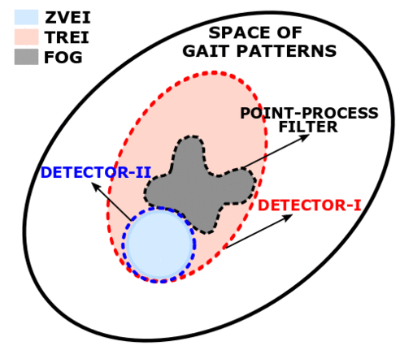

#### Modeling, detecting, and tracking of freezing of gait in Parkinson disease using inertial sensors
##### Background
Parkinson disease (PD) is the second most common neurodegenerative disorder, affecting 1-1.5 million people in the United States alone. Approximately 50% of people with PD experience freezing of gait (FOG), a brief, episodic absence or marked reduction of forward progression of the feet despite the intention to walk. FOG causes falls and is resistant to medication in more than 50% of cases. FOG episodes can often be interrupted by mechanical interventions or strategies (e.g., a verbal reminder to march), but it has not been practical to apply these interventions on demand (e.g., there is not usually another person to detect an FOG episode and provide the reminder). Wearable sensors offer the possibility of detecting FOG episodes in real time and thus develop a "closed-loop" approach to treatment: real time detection could be coupled with on-demand interventions to reduce the duration of FOG episodes.

 

##### Related publications
1. **G. V. Prateek**, I. Skog, M. E. McNeely, R. P. Duncan, G. M. Earhart, and A. Nehorai, "Modeling, detecting, and tracking freezing of gait in Parkinson disease using inertial sensors," to appear in _IEEE Trans. on Biomedical Engineering_.